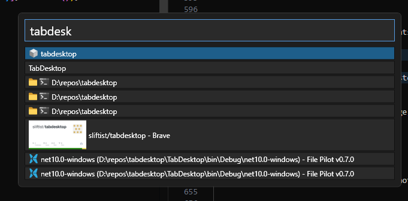

# TabDesktop

**Download:** https://github.com/sliftist/tabdesktop/releases/latest

Browser-style tab strips for your Windows desktop. TabDesktop shows a strip at the top of each monitor listing your open windows as tabs — with icons, favicons, and live thumbnails — so you can see and switch between everything at a glance.

## Features

- One tab per open window, grouped and titled sensibly (e.g. terminals show their working directory)
- Favicons for browser tabs and thumbnails for videos, cached to disk
- Drag tabs to reorder them; the order is remembered across restarts
- Hang-safe window polling — a frozen app never freezes the strip
- Starts without stealing focus

### Browser extension — tabs out of the browser

Install the companion browser extension (from the app's Settings tab) and TabDesktop can expand a browser window into one strip entry per browser tab:

- Right-click a browser window's tab in the strip and toggle "Expand tabs" — each browser tab becomes its own entry, with its own favicon and thumbnail
- Click an entry to switch straight to that browser tab; drag entries to reorder the real tabs in the browser
- The extension also reports exact video thumbnails straight from your tabs, including logged-in sites

### Search

An opt-in global hotkey (default `Win+A`, changeable) pops up a search box centered on your screens:

- Type to search across all tabs — results look exactly like the strip tabs, best matches first
- `Enter` jumps to the selected result; arrow keys / `Tab` / `Shift+Tab` move the selection; `Esc` dismisses
- Enable it in the Settings tab ("Enable search"), where you can also record a different hotkey — it can even take over shell shortcuts like `Win+A`

### More

- Right-click any tab for per-window options: show the process's directory as the title, or use focused-window screenshots as the thumbnail
- Strips can be collapsed or doubled in height per group, and hide automatically when a fullscreen app (movie, game) covers the monitor

## Installing

Download the latest release and run it: https://github.com/sliftist/tabdesktop/releases/latest

## Development

1. Install the .NET 10 SDK: https://dotnet.microsoft.com/download
2. Install Node.js: https://nodejs.org/
3. Install Yarn (https://yarnpkg.com/): `npm install -g yarn`
4. `git clone https://github.com/sliftist/tabdesktop.git`
5. `cd tabdesktop`
6. `yarn start`
